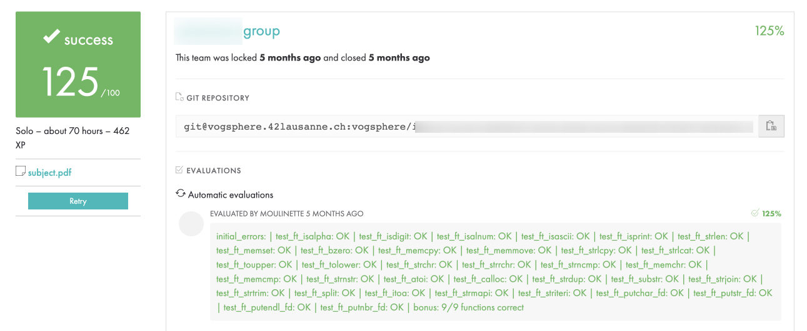

# Libft

## Introduction
The main goal of the `Libft` project at `42Lausanne` is to create a custom `C` library by reimplementing essential standard library functions. This provides a solid foundation for future projects, ensuring a deeper understanding of low-level programming and memory management. Additionally, the project may include utility functions for linked lists, memory management, and string manipulation.

## Key Components of `Libft`:
✅ String functions – `ft_strlen`, `ft_strcpy`, `ft_strjoin`, etc.\
✅ Memory functions – `ft_memset`, `ft_memcpy`, `ft_calloc`, etc.\
✅ Character checks – `ft_isalpha`, `ft_isdigit`, `ft_tolower`, etc.\
✅ Linked lists (bonus) – `ft_lstnew`, `ft_lstadd_back`, `ft_lstmap`, etc.

## Structure:
- `.c` files: Functions implementations.
- `.h` (header) files: Includes all the necessary libraries and function prototypes.
- `Makefile`: Compile the project/script.

## Functions
The `Libft` library consists of:

### **LIBC Functions**
- `ft_isalpha`: Checks if a given character is a letter (either uppercase or lowercase).
- `ft_isdigit`: Determines if a character is a numeric digit (0-9).
- `ft_isalnum`: Verifies whether a character is either a letter or a digit.
- `ft_isascii`: Checks if a character belongs to the ASCII table.
- `ft_isprint`: Determines if a character is printable, including spaces.
- `ft_toupper`: Converts a lowercase letter to uppercase.
- `ft_tolower`: Converts an uppercase letter to lowercase.
- `ft_memset`: Fills a block of memory with a specific byte value.
- `ft_strlen`: Returns the length of a null-terminated string.
- `ft_bzero`: Sets all bytes in a memory block to zero.
- `ft_memcpy`: Copies a specified number of bytes from one memory area to another.
- `ft_memmove`: Copies memory from source to destination, ensuring safe handling of overlapping areas.
- `ft_strlcpy`: Copies a string into a buffer, ensuring null-termination and size safety.
- `ft_strlcat`: Appends one string to another within a given size limit.
- `ft_strchr`: Searches for the first occurrence of a character in a string.
- `ft_strrchr`: Searches for the last occurrence of a character in a string.
- `ft_strncmp`: Compares two strings up to a specified number of characters.
- `ft_memchr`: Scans a memory block to find a specific byte.
- `ft_memcmp`: Compares two memory blocks byte by byte.
- `ft_strnstr`: Locates a substring within a string, considering a maximum search length.
- `ft_strdup`: Creates a new duplicate of a given string, allocating memory for it.
- `ft_atoi`: Converts a string representation of a number into an integer.
- `ft_calloc`: Allocates memory for an array and initializes it to zero.

### **Additional Functions**
- `ft_substr`: Extracts a substring from a given string.
- `ft_strjoin`: Combines two strings into a single new string.
- `ft_strtrim`: Removes leading and trailing characters from a string based on a given set.
- `ft_split`: Splits a string into an array of substrings using a specific delimiter.
- `ft_itoa`: Converts an integer into a string representation.
- `ft_strmapi`: Applies a function to each character of a string, creating a new string with modified values.
- `ft_striteri`: Iterates through a string and applies a function to each character in place.
- `ft_putchar_fd`: Writes a single character to a given file descriptor.
- `ft_putstr_fd`: Writes a string to a given file descriptor.
- `ft_putendl_fd`: Writes a string to a given file descriptor, followed by a newline.
- `ft_putnbr_fd`: Outputs an integer to a given file descriptor.

### **Bonus Functions**
- `ft_lstnew`: Creates a new node for a linked list with given content.
- `ft_lstadd_front`: Adds a new node at the beginning of a linked list.
- `ft_lstsize`: Counts the number of nodes in a linked list.
- `ft_lstlast`: Retrieves the last node in a linked list.
- `ft_lstadd_back`: Adds a new node to the end of a linked list.
- `ft_lstclear`: Deletes and frees all nodes in a linked list.
- `ft_lstiter`: Iterates through a linked list and applies a function to each node’s content.
- `ft_lstmap`: Creates a new linked list by applying a function to each node’s content.
